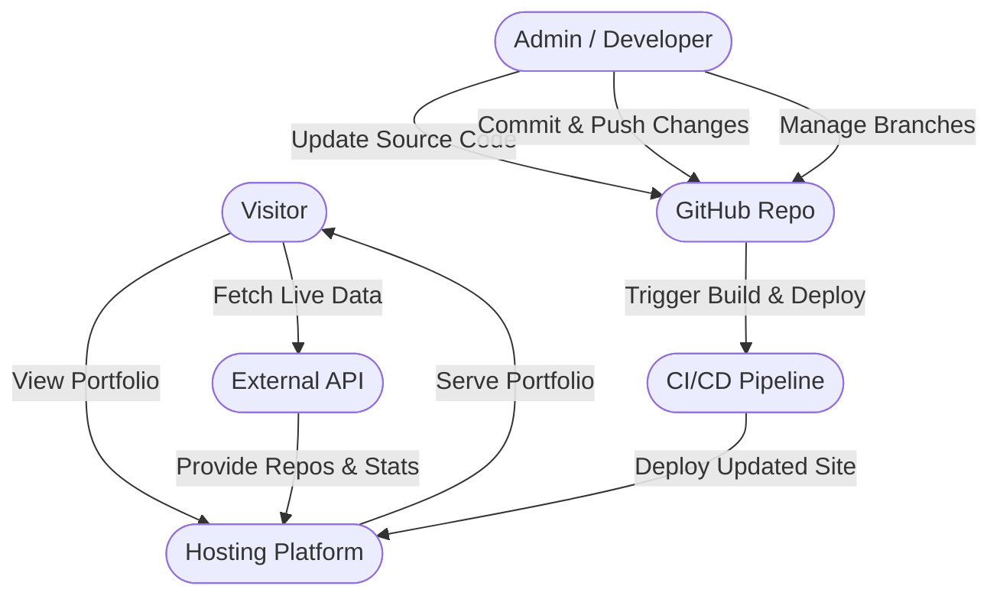
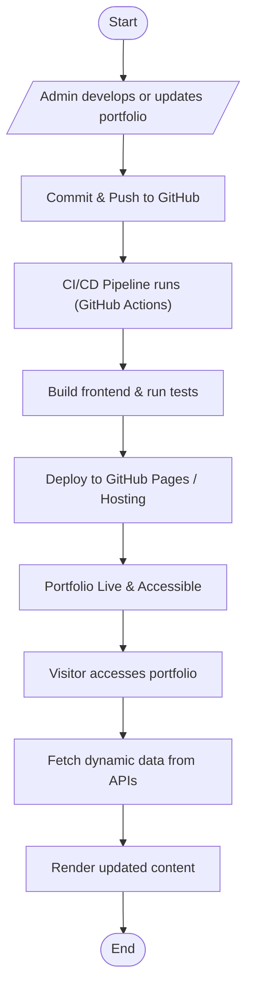
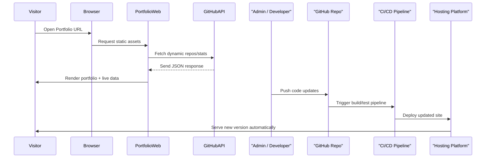

# **Actors for SDLC Portfolio**

### **Primary Actors**

* **Visitor (End User)** → Anyone viewing your portfolio.
* **Admin / Developer (You)** → Builds, maintains, and updates the portfolio.
* **CI/CD Pipeline (GitHub Actions)** → Automates build, test, and deployment.
* **Hosting Platform (GitHub Pages / Vercel / Netlify)** → Serves the live portfolio.

### **Secondary Actors**

* **Version Control System (GitHub Repo)** → Stores source code, manages commits, branches, and releases.
* **External API(s)** → GitHub API, analytics, or any integrated service that feeds live stats.
* **Authentication Service** → GitHub authentication for secure commits and deployments.
* **User’s Browser** → Renders the frontend and triggers API calls.

---

# **UML Use Case Diagram**

---

# **UML Activity Diagram (SDLC Workflow + User Flow)**

---

# **UML Sequence Diagram (Live Data + CI/CD)**

---

