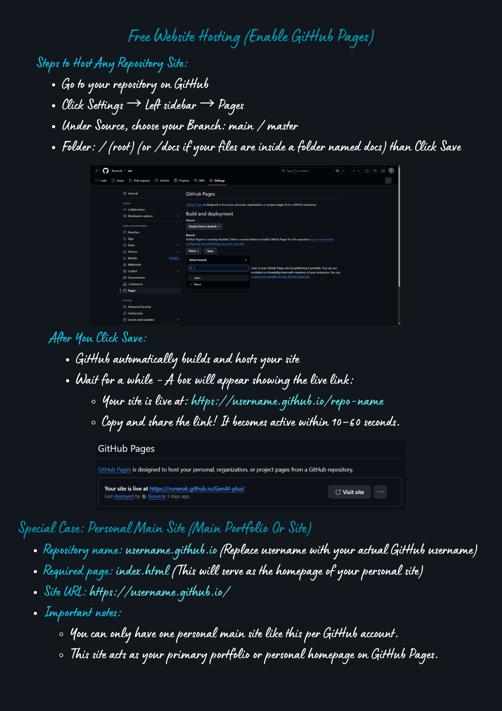

# 🚀 Deployment Guide

**Project Name:** GitHub Portfolio Generator  
**Author:** Runarok  
**Phase:** Deployment  
**Last Updated:** August 26, 2025

This document explains how to deploy your portfolio website using **GitHub Pages**, both via the default branch and the `gh-pages` branch method.

---

## 📂 Free Website Hosting (Enable GitHub Pages)

### Steps to Host Any Repository Site:

- Go to your repository on **GitHub**.
- Click **Settings** → left sidebar → **Pages**.
- Under **Source**, choose your branch (typically `main` or `master`).
- Select the folder:
  - `/ (root)` if your files are at the repository root
  - `/docs` if your files are inside a folder named `docs`
- Click **Save**.

### After You Click Save:

- GitHub automatically builds and hosts your site.
- Wait a moment — a box will appear showing the live link:
  - Your site will be live at:  
    `https://username.github.io/repo-name`
  - Copy and share the link! It becomes active within 10–60 seconds.

---

## 🔸 Special Case: Personal Main Site (Main Portfolio or Site)

- Repository name: `username.github.io`  
  *(Replace `username` with your actual GitHub username)*
- Required page: `index.html`  
  *(This serves as the homepage of your personal site)*
- Site URL:  
  `https://username.github.io/`
- Important notes:
  - You can have **only one personal main site** like this per GitHub account.
  - This site acts as your **primary portfolio or personal homepage** on GitHub Pages.

---

## 📦 Alternative Deployment Using `gh-pages` Branch

Another common approach to deploying GitHub Pages is via a dedicated branch named `gh-pages`. This is especially useful if you want to keep your deployment files separate from your main source code.

### How to Deploy Using `gh-pages` Branch:

1. Create a branch named `gh-pages` in your repository.
2. Build or place your static website files (HTML, CSS, JS, assets) in the root of this branch.
3. Go to **Settings → Pages**.
4. Under **Source**, select the `gh-pages` branch and root (`/`) folder.
5. Click **Save**.
6. Your site will be live at:  
   `https://username.github.io/repo-name`  
   *(Replace `username` and `repo-name` accordingly)*

---

## 🔗 Additional Resources

- [GitHub Pages Documentation](https://docs.github.com/en/pages/getting-started-with-github-pages)
- [Publishing a GitHub Pages Site from the gh-pages Branch](https://docs.github.com/en/pages/configuring-a-publishing-source-for-your-github-pages-site-with-github-actions/about-github-pages#publishing-sources)

---

> 💡 **Tip:** You can automate deployment to `gh-pages` using GitHub Actions or tools like `gh-pages` npm package for seamless CI/CD.

---

By following these steps, you can host your portfolio site easily and make it publicly accessible via GitHub Pages!

